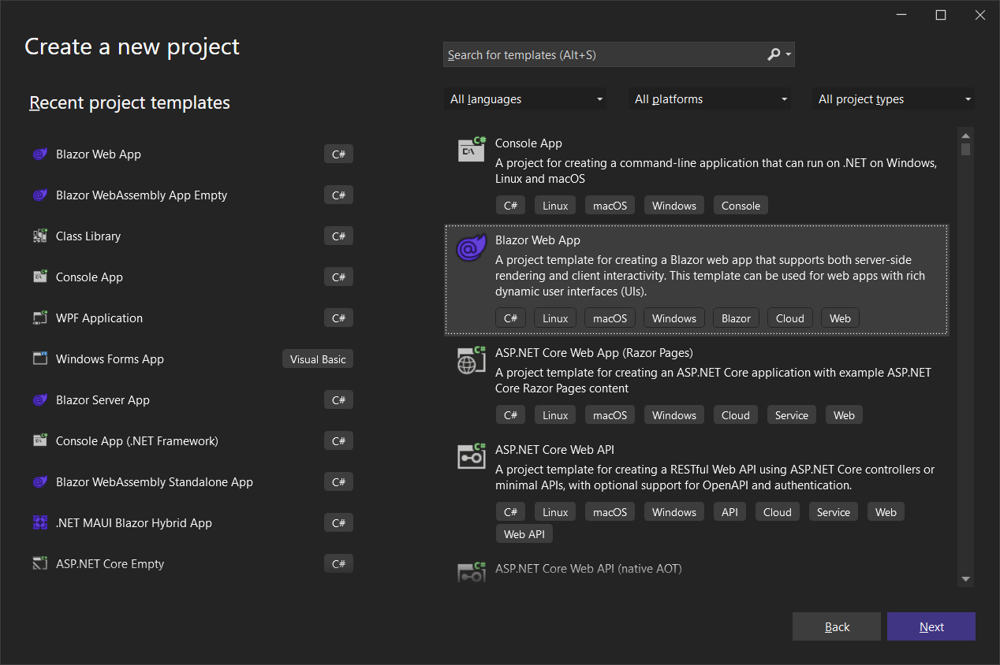
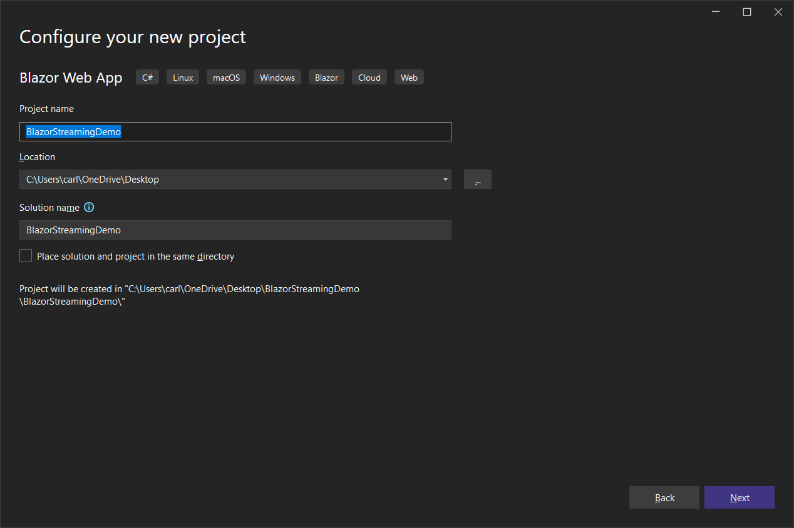
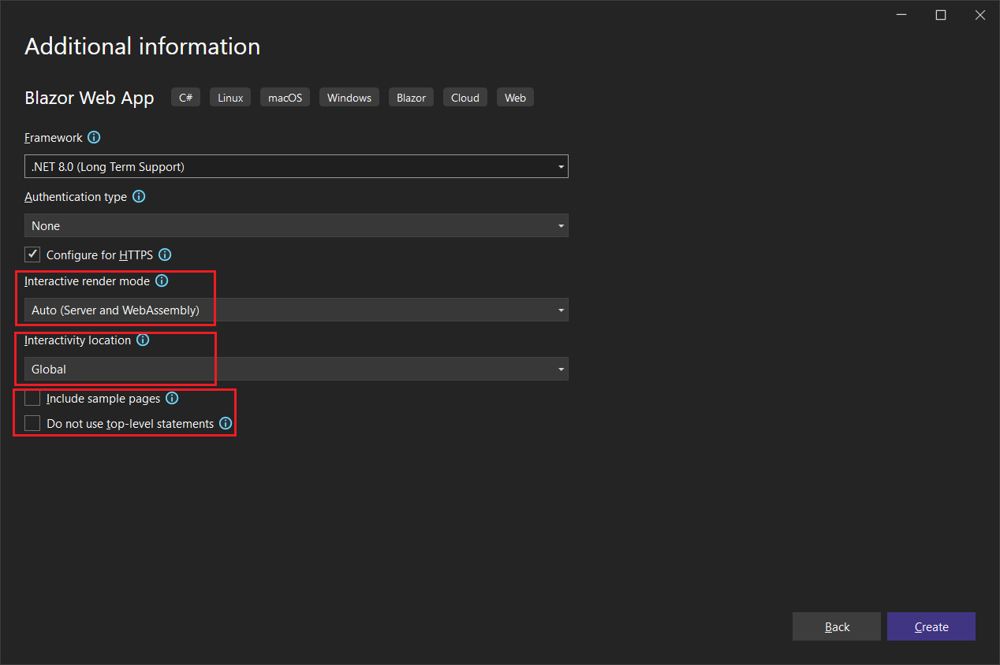
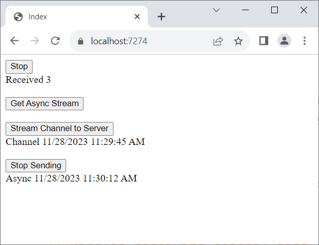
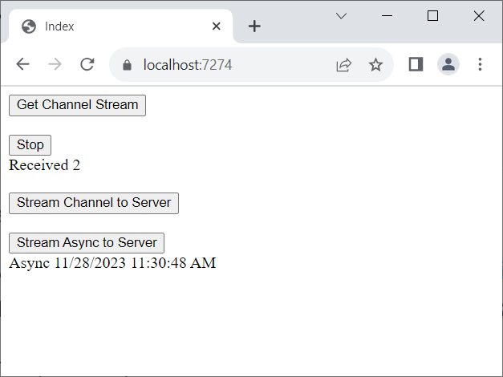
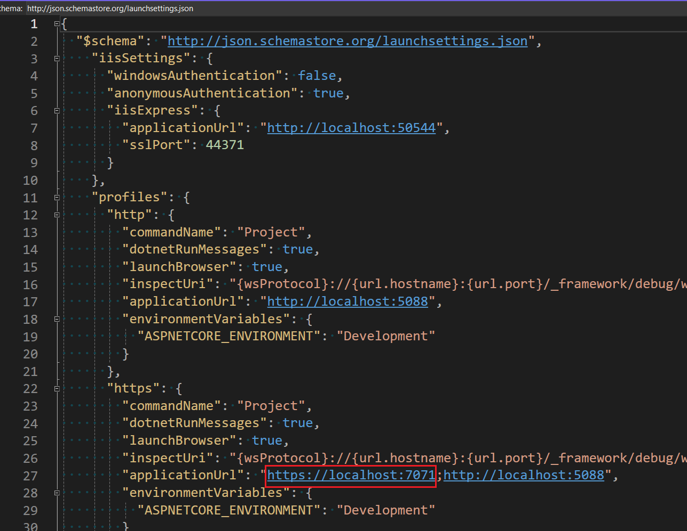
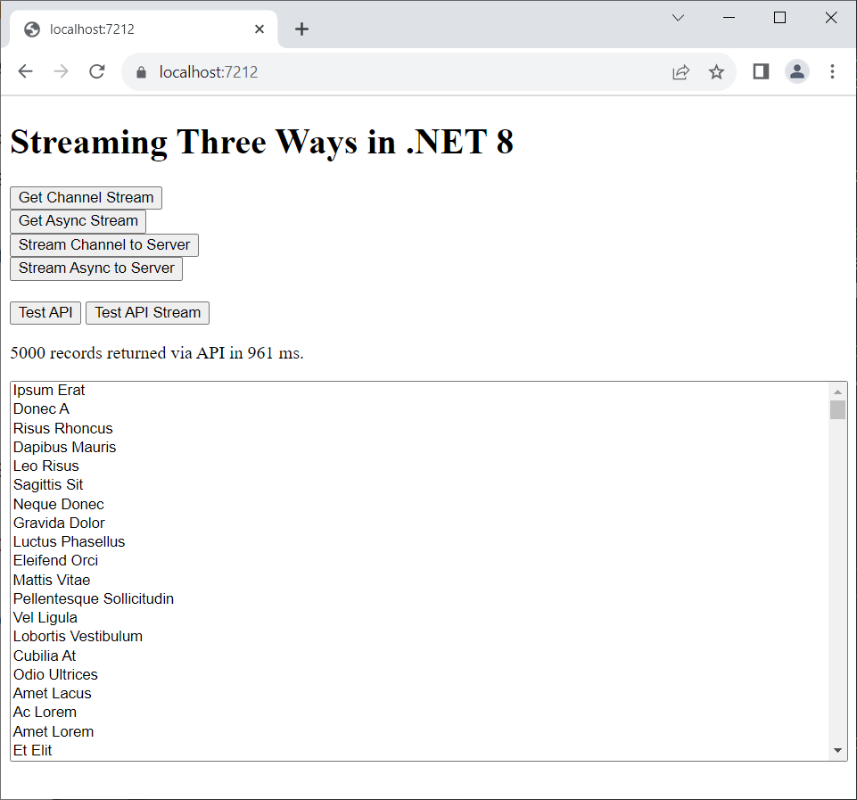
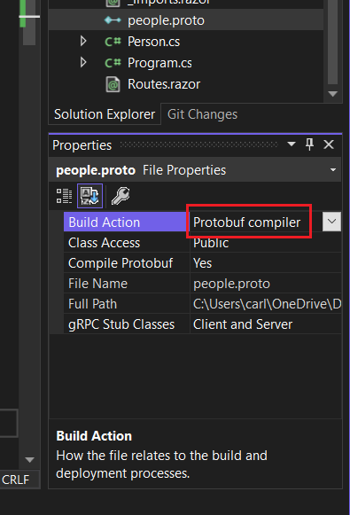
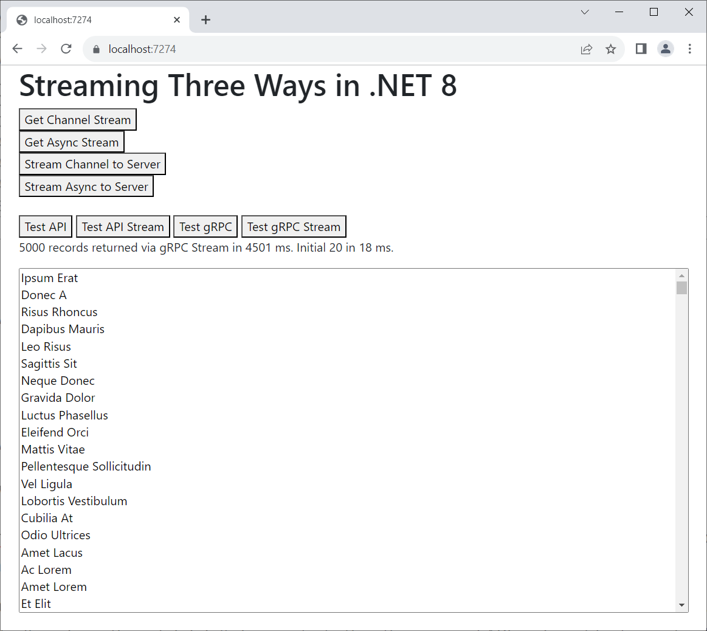

# Streaming Three Ways (SignalR, REST, and gPRC)

This repo and documentation compares performance and scalability of streaming with SignalR, REST, and gRPC in a .NET 8 Blazor Web App using RenderMode.Auto.

For a .NET 7 demo, go to https://github.com/carlfranklin/BlazorStreamingDemo

### Overview

Before we talk about Blazor, SignalR, REST, or gRPC, let's talk about streaming.

##### Streaming is not System.IO.Stream

Streaming is more about the `yeild` keyword than about anything in the `System.IO` namespace.

Streaming is the use of the Iterator pattern to return one item at a time from an IEnumerable method.

Create a new console app and replace *Program.cs* with the following:

```c#
// STREAMING has nothing to do with STREAMS
// Streaming uses the Iterator pattern

// retrieve a sequence of messages
var Messages = GetMessages();

// display the messages
foreach (var msg in Messages)
{
    Console.WriteLine(msg.Text);
}

// and we're done
Console.WriteLine("Done");

// method to return data.
// imagine this is coming from a database or some other source
IEnumerable<Message> GetMessages()
{
    var messages = new List<Message>();
    for (int i = 0; i < 3; i++) 
    {
        var msg = new Message() { Text = $"Hello {i}" };
        messages.Add(msg);
    }
    return messages;
}

public class Message
{
    public string? Text { get; set; }
}
```

This code does not stream. `GetMessage()` returns a complete list after being filled up. Stepping through the code line by line will reveal how it works. This is our starting point.

Now let's turn it into a streaming demo. Replace with this code:

```c#
// STREAMING has nothing to do with STREAMS
// Streaming uses the Iterator pattern

// retrieve a sequence of messages
var Messages = GetMessages();

// display the messages
foreach (var msg in Messages)
{
    Console.WriteLine(msg.Text);
}

// and we're done
Console.WriteLine("Done");

// method to return data.
// imagine this is coming from a database or some other source
IEnumerable<Message> GetMessages()
{
    //var messages = new List<Message>();
    for (int i = 0; i < 3; i++) 
    {
        var msg = new Message() { Text = $"Hello {i}" };
        yield return msg;
        //messages.Add(msg);
    }
    //return messages;
}

public class Message
{
    public string? Text { get; set; }
}
```

I have uncommented the lines in `GetMessages()`, which has the same signature as before. Instead of returning an entire `List<Message>` we are using the `yield` keyword to return one item at a time.

Stepping through the code, you can see that the code pointer blows right over the call to `GetMessages()`, and once the code hits `yield return msg`; the code pointer immediately jumps back to ` Console.WriteLine(msg.Text);` effectively pulling out one `Message` object at a time, and eliminating the need to return a complete `List<Message>`.

This is streaming.

Streaming means using the Iterator pattern with `yield return`

Streaming does not mean using `System.IO` constructs like `FileStream`, `MemoryStream`, `NetworkStream`, etc.

There are situations where you can even re-use a single object to provide a stream, to reduce memory pressure. 

Change the `GetMessages()` method to this:

```c#
IEnumerable<Message> GetMessages()
{
    var msg = new Message();
    for (int i = 0; i < 3; i++) 
    {
        msg.Text = $"Hello {i}";
        yield return msg;
    }
}
```

This works when you run it, but ***BEWARE!*** There be dragons!

Everything is fine if you only iterate once over the returned set, but watch what happens when we iterate twice, like so:

```c#
// STREAMING has nothing to do with STREAMS
// Streaming uses the Iterator pattern

// retrieve a sequence of messages
var Messages = GetMessages();

// display the messages
foreach (var msg in Messages)
{
    Console.WriteLine(msg.Text);
}
 
// display the messages AGAIN
foreach (var msg in Messages)	// put a breakpoint here
{
    Console.WriteLine(msg.Text);
}

// and we're done
Console.WriteLine("Done");

// method to return data.
// imagine this is coming from a database or some other source
IEnumerable<Message> GetMessages()
{
    var msg = new Message();
    for (int i = 0; i < 3; i++) 
    {
        msg.Text = $"Hello {i}";
        yield return msg;
    }
}

public class Message
{
    public string? Text { get; set; }
}
```

Once you hit the second iteration, The `GetMessage()` method is called again. 

> **TIP:** If you are only iterating over the result set once, you can save memory by re-using the same object before calling `return yield;`

The `yield` statement has been in .NET since version 2.0! That's how long we've been able to stream. So what's different now?

#### Async Streaming

C# 8 (ASP.NET Core 3.0) introduced Async streaming with `IAsyncEnumerable<T>` which combines the Iterator pattern with async code.

Without Async streaming using`IAsyncEnumerable<T>` you cannot call `yield return` in an async method.

Because it's async, your UI can start working as soon as the first record arrives. 

Async streaming is a pull operation, not a push operation.

Also, async streaming is not about performance. It's about scalability.

Let's change our code to use async streaming:

```c#
// Async Streaming uses the Iterator pattern
// (yield return) WITH async!

// Without async streams, you can NOT do yield return
// from an async method.

// Because it's async, your UI can start working
// as soon as the first record arrives.

// async streaming is a PULL operation, not a PUSH.

// Async streaming is NOT about performance.
// It's about scalability.

// display messages using 'await foreach'
await foreach (var msg in GetMessages())
{
    Console.WriteLine(msg.Text);
}

// and we're done
Console.WriteLine("Done");

// IAsyncEnumerable is a ValueTask, not a Task
// ValueTask should be used when lots of data is
// to be streamed and therefore memory needs to 
// be conserved. ValueTask creates 0 Gen 1 allocations
// whereas Task creates Gen 1 allocations.
async IAsyncEnumerable<Message> GetMessages()
{
    // just to have something async in here!
    await Task.Delay(0);

    for (int i = 0; i < 3; i++) 
    {
        var msg = new Message() { Text = $"Hello {i}" };
        yield return msg;
    }
}

public class Message
{
    public string? Text { get; set; }
}
```

`IAsyncEnumerable` is a ValueTask, so you don't need to use it inside a Task. It IS a task. 

This code also uses `await foreach`, a subtle difference from calling `await GetMessages()`

Step through the code and you will see that it's the same flow as the streaming code we just ran, but now since it's being called asynchronously, the UI can start showing data as soon as the first object arrives. That will make a big difference when we start streaming to a Blazor client.

Create a Blazor Web App app called **BlazorStreamingDemo** 





Use the following configuration:



For the remainder of this demo, when I mention the **Server** project, I'm referring to **BlazorStreamingDemo**. When I mention the **Client** project, I'm referring to **BlazorStreamingDemo.Client**.

## SignalR

We're going to start our Blazor Streaming demos with SignalR just because it's the easiest to set up and get running right away. Also, SignalR has an old way and a new way to stream, so it's a bit of a different animal than a REST API or gRPC service.

Add the following package reference to the **both** the client and server projects' .csproj file:

```xml
<PackageReference Include="Microsoft.AspNetCore.SignalR.Client" Version="8.0.0" />
```

SignalR server-side code (Hubs) is built into ASP.NET, but we need this library in order to call into the hub from Blazor.

We need to add the client library to the server project because we're using `RenderMode.InteractiveAuto`, which means we need to support Blazor Server as well as WebAssembly.

Add the following to the server project's *Program.cs* file just before the line `var app = builder.Build();`

```c#
builder.Services.AddSignalR();
```

Also add this at the bottom just before `app.Run();`

```c#
app.MapHub<StreamHub>("/StreamHub");
```

Add *StreamHub.cs* to the server project:

```c#
public class StreamHub : Hub
{
    // This code was adapted from the following documentation:
    // https://docs.microsoft.com/en-us/aspnet/core/signalr/streaming?view=aspnetcore-8.0

    /* 
      A channel is simply a data structure that’s used to store 
      produced data for a consumer to retrieve, and an appropriate 
      synchronization to enable that to happen safely, while also 
      enabling appropriate notifications in both directions.
      Ref: https://devblogs.microsoft.com/dotnet/an-introduction-to-system-threading-channels/
     
      The Channel method has been available since ASP.NET Core 2.1
     
      ASP.NET Core 3.0 introduced streaming from the client to the server.

      C# 8 introduced asynchronous streaming using IAsyncEnumerable, available
      in .NET Core 3.0 +
     */

    #region "Stream channel to client"
    public ChannelReader<int> GetChannelStream(
        int count,
        int delay,
        CancellationToken cancellationToken)
    {
        var channel = Channel.CreateBounded<int>(10);

        // The underscore _ is a "discard", declaring your intent to
        // ignore the return value. It's the polite thing to do.
        // Ref: https://docs.microsoft.com/en-us/dotnet/csharp/fundamentals/functional/discards

        // We don't want to await WriteItemsAsync, otherwise we'd end up waiting 
        // for all the items to be written before returning the channel back to
        // the client.

        _ = WriteItemsAsync(channel.Writer, count, delay, cancellationToken);

        return channel.Reader;
    }

    private async Task WriteItemsAsync(
        ChannelWriter<int> writer,
        int count,
        int delay,
        CancellationToken cancellationToken)
    {
        // Use the "damn-it" operator (!) to appease the compiler
        // Ref: https://codeblog.jonskeet.uk/category/c-8/
        Exception localException = null!;
        try
        {
            for (var i = 0; i < count; i++)
            {
                await writer.WriteAsync(i, cancellationToken);

                // Use the cancellationToken in other APIs that accept cancellation
                // tokens so the cancellation can flow down to them.

            // https://docs.microsoft.com/en-us/dotnet/standard/threading/cancellation-in-managed-threads

                await Task.Delay(delay, cancellationToken);
            }
        }
        catch (Exception ex)
        {
            localException = ex;
        }
        finally
        {
            writer.Complete(localException);
        }
    }
    #endregion

    #region "Stream async stream to client"
    public async IAsyncEnumerable<int> GetAsyncStream(
        int count,
        int delay,
        [EnumeratorCancellation]
        CancellationToken cancellationToken)
    {
        for (var i = 0; i < count; i++)
        {
            // Check the cancellation token regularly so that the server will stop
            // producing items if the client disconnects.
            cancellationToken.ThrowIfCancellationRequested();

            yield return i;

            // Use the cancellationToken in other APIs that accept cancellation
            // tokens so the cancellation can flow down to them.
            await Task.Delay(delay, cancellationToken);
        }
    }
    #endregion

    #region "Receive channel stream from client"
    public async Task UploadStreamToChannel(ChannelReader<string> stream)
    {
        while (await stream.WaitToReadAsync())
        {
            while (stream.TryRead(out var item))
            {
                await Clients.All.SendAsync("ReceiveChannelStreamData", item);
            }
        }
    }
    #endregion

    #region "Receive async stream from client"
    // Streaming from client to server using newer Async Stream
    public async Task UploadAsyncStream(IAsyncEnumerable<string> stream)
    {
        await foreach (var item in stream)
        {
            await Clients.All.SendAsync("ReceiveAsyncStreamData", item);
        }
    }
    #endregion

}
```

This hub was adapted from the documentation at https://docs.microsoft.com/en-us/aspnet/core/signalr/streaming?view=aspnetcore-8.0

**Channels**

There are two ways to stream with SignalR, using **channels** (the old way) or **async streaming** (new and shiny).

A channel is a data structure that’s used to store produced data for a consumer to retrieve, and an appropriate       synchronization to enable that to happen safely, while also enabling appropriate notifications in both directions.

Channels have been around since ASP.NET Core 2.1

You can read more about channels at https://devblogs.microsoft.com/dotnet/an-introduction-to-system-threading-channels/

Check out `GetChannelStream()`:

```c#
public ChannelReader<int> GetChannelStream(
    int count,
    int delay,
    CancellationToken cancellationToken)
{
    var channel = Channel.CreateBounded<int>(10);

    // The underscore _ is a "discard", declaring your intent to
    // ignore the return value. It's the polite thing to do.
    // Ref: https://docs.microsoft.com/en-us/dotnet/csharp/fundamentals/functional/discards

    // We don't want to await WriteItemsAsync, otherwise we'd end up waiting 
    // for all the items to be written before returning the channel back to
    // the client.

    _ = WriteItemsAsync(channel.Writer, count, delay, cancellationToken);

    return channel.Reader;
}
```

`GetChannelStream` returns a `ChannelReader<int>` 

Keep in mind this is happening in a Hub. A client will call this, return the `ChannelReader` and iterate through the data. 

**Bounded vs Unbounded Channels**

A bounded channel has a finite number of elements that can be transmitted. Use it if you know the number of items before streaming.

An unbounded channel is open-ended, and won't stop making data available until the `CancellationToken` is used to stop the transmission.

For clarity's sake, I have separated out the code that actually does the transmitting into a method called `WriteItemsAsync()`:

```c#
private async Task WriteItemsAsync(
    ChannelWriter<int> writer,
    int count,
    int delay,
    CancellationToken cancellationToken)
{
    // Use the "damn-it" operator (!) to appease the compiler
    // Ref: https://codeblog.jonskeet.uk/category/c-8/
    Exception localException = null!;
    try
    {
        for (var i = 0; i < count; i++)
        {
            await writer.WriteAsync(i, cancellationToken);

            // Use the cancellationToken in other APIs that accept cancellation
            // tokens so the cancellation can flow down to them.

            // https://docs.microsoft.com/en-us/dotnet/standard/threading/cancellation-in-managed-threads

            await Task.Delay(delay, cancellationToken);
        }
    }
    catch (Exception ex)
    {
        localException = ex;
    }
    finally
    {
        writer.Complete(localException);
    }
}
```

This code simply writes a series of integers to the channel in a loop, with a delay between each one. The count and the delay are ultimately passed in by the client. 

If it seems like a lot of work, you're right to assume. It is, but before C# 8, this is what we had.

#### **Client Code** 

Before we run any Blazor code, let's add this statement to *_Imports.razor* in the client project:

```c#
@using Microsoft.AspNetCore.SignalR.Client
```

Now, change the contents of *Pages/Home.razor* to the following:

```c#
@page "/"
@using System.Threading.Channels
@inject NavigationManager NavigationManager

<PageTitle>Index</PageTitle>

<button @onclick="GetChannelStream">@channelButtonText</button>
<br />
<div>@channelMessage</div>
<br />

<button @onclick="GetAsyncStream">@asyncButtonText</button>
<br />
<div>@asyncMessage</div>
<br />

<button @onclick="StreamChannelToServer">@sendChannelButtonText</button>
<br />
<div>@receiveChannelMessage</div>
<br />

<button @onclick="StreamAsyncToServer">@sendAsyncButtonText</button>
<br />
<div>@receiveAsyncMessage</div>
<br />

@code
{
    // Make objects nullable.
    // Check out The .NET Show episode 15 "It's a Nullable World"
    // at https://thedotnetshow.com
    private HubConnection? hubConnection;

    #region "Stream Channel from server to client"
    private CancellationTokenSource? channelCancellationTokenSource;
    private string channelMessage = "";
    private string channelButtonText = "Get Channel Stream";
    private async Task GetChannelStream()
    {
        // It's a nullable world!
        if (hubConnection is null) return;

        // Ready to roll?
        @if (channelButtonText == "Get Channel Stream")
        {
            // Change to "Stop"
            channelButtonText = "Stop";

            // the cancellationToken lets us stop the stream download
            channelCancellationTokenSource = new CancellationTokenSource();

            // Create the channel from the hub
            // specifying we want to receive 10 consecutive ints
            // exactly 500ms apart.
            var channel = await hubConnection.StreamAsChannelAsync<int>(
                "GetChannelStream", 10, 500, channelCancellationTokenSource.Token);

            // Wait asynchronously for data to become available
            while (await channel.WaitToReadAsync())
            {
                // Read all currently available data synchronously, before waiting for more data
                while (channel.TryRead(out var count))
                {
                    // change the message string
                    channelMessage = $"Received {count}";
                    // tell Blazor to render the page
                    await InvokeAsync(StateHasChanged);
                }
            }
        }
        else
        {
            // Stop the stream
            channelCancellationTokenSource?.Cancel();
        }

        // Reset the button text
        channelButtonText = "Get Channel Stream";
        channelMessage = "";
    }
    #endregion

    #region Stream Async stream from server to client
    private CancellationTokenSource? asyncCancellationTokenSource;
    private string asyncMessage = "";
    private string asyncButtonText = "Get Async Stream";

    private async Task GetAsyncStream()
    {
        // It's a nullable world!
        if (hubConnection is null) return;

        // Ready to roll?
        @if (asyncButtonText == "Get Async Stream")
        {
            // Change to "Stop"
            asyncButtonText = "Stop";

            // the cancellationToken lets us stop the stream download
            asyncCancellationTokenSource = new CancellationTokenSource();

            // Create the stream from the hub
            // specifying we want to receive 10 consecutive ints
            // exactly 500ms apart.
            var stream = hubConnection.StreamAsync<int>(
                "GetAsyncStream", 10, 500, asyncCancellationTokenSource.Token);

            // display the values as they are received
            await foreach (var count in stream)
            {
                // change the message string
                asyncMessage = $"Received {count}";
                // tell Blazor to render the page
                await InvokeAsync(StateHasChanged);
            }
        }
        else
        {
            // Stop the stream
            asyncCancellationTokenSource?.Cancel();
        }

        // Reset the button text
        asyncButtonText = "Get Async Stream";
        asyncMessage = "";
    }
    #endregion

    #region Stream Channel from client to server

    private string receiveChannelMessage = "";
    private bool sendChannelCancelled = false;
    private string sendChannelButtonText = "Stream Channel to Server";

    private async Task StreamChannelToServer()
    {
        // It's a nullable world!
        if (hubConnection is null) return;
        @if (sendChannelButtonText == "Stream Channel to Server")
        {
            sendChannelButtonText = "Stop Sending";

            // Create a channel with no end
            var channel = Channel.CreateUnbounded<string>();

            await hubConnection.SendAsync("UploadStreamToChannel", channel.Reader);
            sendChannelCancelled = false;
            while (!sendChannelCancelled)
            {
                string value = "Channel " + DateTime.Now.ToString();
                await channel.Writer.WriteAsync(value);
                await Task.Delay(1000);
            }

            channel.Writer.Complete();
        }
        else
        {
            sendChannelCancelled = true;
            sendChannelButtonText = "Stream Channel to Server";
            receiveChannelMessage = "";

        }
    }
    #endregion

    #region Stream Async stream from client to server

    private string receiveAsyncMessage = "";
    private bool sendAsyncCancelled = false;
    private string sendAsyncButtonText = "Stream Async to Server";

    private async Task StreamAsyncToServer()
    {
        // It's a nullable world!
        if (hubConnection is null) return;
        @if (sendAsyncButtonText == "Stream Async to Server")
        {
            sendAsyncButtonText = "Stop Sending";
            await hubConnection.SendAsync("UploadAsyncStream", ClientStreamData());
        }
        else
        {
            sendAsyncCancelled = true;
            sendAsyncButtonText = "Stream Async to Server";
        }
    }

    private async IAsyncEnumerable<string> ClientStreamData()
    {
        sendAsyncCancelled = false;
        while (!sendAsyncCancelled)
        {
            string value = "Async " + DateTime.Now.ToString();
            yield return value;
            await Task.Delay(1000);
        }
    }
    #endregion

    protected override async Task OnInitializedAsync()
    {
        // Create the hubConection
        hubConnection = new HubConnectionBuilder()
           .WithUrl(NavigationManager.ToAbsoluteUri("/streamhub"))
           .Build();

        // Start the hub Connection (connects to the hub);
        await hubConnection.StartAsync();

        // Handles receiving channel data
        hubConnection.On<string>("ReceiveChannelStreamData", async (message) =>
        {
            receiveChannelMessage = message;
            await InvokeAsync(StateHasChanged);
        });

        // Handles receiving async stream data
        hubConnection.On<string>("ReceiveAsyncStreamData", async (message) =>
        {
            receiveAsyncMessage = message;
            await InvokeAsync(StateHasChanged);
        });
    }
}
```

Scroll to the bottom and we'll look at `OnInitializedAsync()`:

```c#
    protected override async Task OnInitializedAsync()
    {
        // Create the hubConection
        hubConnection = new HubConnectionBuilder()
           .WithUrl(NavigationManager.ToAbsoluteUri("/streamhub"))
           .Build();

        // Start the hub Connection (connects to the hub);
        await hubConnection.StartAsync();

        // Handles receiving channel data
        hubConnection.On<string>("ReceiveChannelStreamData", async (message) =>
        {
            receiveChannelMessage = message;
            await InvokeAsync(StateHasChanged);
        });

        // Handles receiving async stream data
        hubConnection.On<string>("ReceiveAsyncStreamData", async (message) =>
        {
            receiveAsyncMessage = message;
            await InvokeAsync(StateHasChanged);
        });
    }
```

We won't need the handlers until the third and fourth demo, so this should look straightforward if you've done any SignalR work before.

**Demo 1: Channel Stream from Server to Client**

The first button calls `GetChannelStream` when clicked, and shows `channelMessage` which we will update. Note that the text of the button is dynamic, showing the value of `channelButtonText`, a string variable.

```html
<button @onclick="GetChannelStream">@channelButtonText</button>
<br />
<div>@channelMessage</div>
<br />
```

Let's look at `GetChannelStream():`

```c#
private CancellationTokenSource? channelCancellationTokenSource;
private string channelMessage = "";
private string channelButtonText = "Get Channel Stream";
private async Task GetChannelStream()
{
    // It's a nullable world!
    if (hubConnection is null) return;

    // Ready to roll?
    @if (channelButtonText == "Get Channel Stream")
    {
        // Change to "Stop"
        channelButtonText = "Stop";

        // the cancellationToken lets us stop the stream download
        channelCancellationTokenSource = new CancellationTokenSource();

        // Create the channel from the hub
        // specifying we want to receive 10 consecutive ints
        // exactly 500ms apart.
        var channel = await hubConnection.StreamAsChannelAsync<int>(
            "GetChannelStream", 10, 500, channelCancellationTokenSource.Token);

        // Wait asynchronously for data to become available
        while (await channel.WaitToReadAsync())
        {
            // Read all currently available data synchronously, before waiting for more data
            while (channel.TryRead(out var count))
            {
                // change the message string
                channelMessage = $"Received {count}";
                // tell Blazor to render the page
                await InvokeAsync(StateHasChanged);
            }
        }
    }
    else
    {
        // Stop the stream
        channelCancellationTokenSource?.Cancel();
    }

    // Reset the button text
    channelButtonText = "Get Channel Stream";
    channelMessage = "";
}
```

I'm using the value of `channelButtonText` to determine what to do here. 

This code creates the channel from the Hub:

```c#
var channel = await hubConnection.StreamAsChannelAsync<int>(
    "GetChannelStream", 10, 500, channelCancellationTokenSource.Token);
```

You can't help but admire the magic here! We're calling a SignalR Hub method by name and getting back a `ChannelReader<int>`! 

Next, we go into a double-loop:

```c#
// Wait asynchronously for data to become available
while (await channel.WaitToReadAsync())
{
    // Read all currently available data synchronously, before waiting for more data
    while (channel.TryRead(out var count))
    {
        // change the message string
        channelMessage = $"Received {count}";
        // tell Blazor to render the page
        await InvokeAsync(StateHasChanged);
    }
}
```

The outer loop waits for data (`channel.WaitToReadAsync()`) and the inner loop reads the data (an `int`) into the `count` variable, which we then display in the `channelMessage`.

Notice that this is a push operation. The client has to wait for data to show up. In the next demo, we'll use async streaming, which is a pull operation. Data is pulled from the source.

Let's look at the next demo, which streams data to the client.

Let's go back to the Hub and check out the `GetAsyncStream()` method:

```c#
public async IAsyncEnumerable<int> GetAsyncStream(
    int count,
    int delay,
    [EnumeratorCancellation]
    CancellationToken cancellationToken)
{
    for (var i = 0; i < count; i++)
    {
        // Check the cancellation token regularly so that the server will stop
        // producing items if the client disconnects.
        cancellationToken.ThrowIfCancellationRequested();

        yield return i;

        // Use the cancellationToken in other APIs that accept cancellation
        // tokens so the cancellation can flow down to them.
        await Task.Delay(delay, cancellationToken);
    }
}
```

That's quite a bit less code than the `GetChannelStream()` hub method, isn't it? We pass the count and delay values, go into a loop and call `yield return i` followed by a delay. 

Let's look at the client method that calls this, which is also called`GetAsyncStream()`

```c#
private CancellationTokenSource? asyncCancellationTokenSource;
private string asyncMessage = "";
private string asyncButtonText = "Get Async Stream";

private async Task GetAsyncStream()
{
    // It's a nullable world!
    if (hubConnection is null) return;

    // Ready to roll?
    @if (asyncButtonText == "Get Async Stream")
    {
        // Change to "Stop"
        asyncButtonText = "Stop";

        // the cancellationToken lets us stop the stream download
        asyncCancellationTokenSource = new CancellationTokenSource();

        // Create the stream from the hub
        // specifying we want to receive 10 consecutive ints
        // exactly 500ms apart.
        var stream = hubConnection.StreamAsync<int>(
            "GetAsyncStream", 10, 500, asyncCancellationTokenSource.Token);

        // display the values as they are received
        await foreach (var count in stream)
        {
            // change the message string
            asyncMessage = $"Received {count}";
            // tell Blazor to render the page
            await InvokeAsync(StateHasChanged);
        }
    }
    else
    {
        // Stop the stream
        asyncCancellationTokenSource?.Cancel();
    }

    // Reset the button text
    asyncButtonText = "Get Async Stream";
    asyncMessage = "";
}
```

Here's the meat of the method:

```c#
// Create the stream from the hub
// specifying we want to receive 10 consecutive ints
// exactly 500ms apart.
var stream = hubConnection.StreamAsync<int>(
    "GetAsyncStream", 10, 500, asyncCancellationTokenSource.Token);

// display the values as they are received
await foreach (var count in stream)
{
    // change the message string
    asyncMessage = $"Received {count}";
    // tell Blazor to render the page
    await InvokeAsync(StateHasChanged);
}
```

We retrieve a stream from the SignalR hub, and then simply iterate over it. It's much cleaner and easier to understand. Not only that, but its a pull operation.

**Streaming from the Client to the Hub**

Why would you need to do this? Consider an application where one client generates the data, such as video from a webcam, and broadcasts it to the other clients. SignalR can handle this scenario using a **channel** as well as **async streaming**.

Let's go back to the hub and look at the `UploadStreamToChannel` method:

```c#
public async Task UploadStreamToChannel(ChannelReader<string> stream)
{
    while (await stream.WaitToReadAsync())
    {
        while (stream.TryRead(out var item))
        {
            await Clients.All.SendAsync("ReceiveChannelStreamData", item);
        }
    }
}
```

Again we have the inside and outside loop, but this time it's in the hub, not on the client.

Note that the hub code sends a `ReceiveChannelStreamData` message to all clients, including the sender. That's because all of the clients want display the message, including the sender's client. If this doesn't work for you in your scenario, you can use `Callers.Others` instead of `Callers.All`.

Let's look at the client method: `StreamChannelToServer()`:

```c#
private string receiveChannelMessage = "";
private bool sendChannelCancelled = false;
private string sendChannelButtonText = "Stream Channel to Server";

private async Task StreamChannelToServer()
{
    // It's a nullable world!
    if (hubConnection is null) return;
    @if (sendChannelButtonText == "Stream Channel to Server")
    {
        sendChannelButtonText = "Stop Sending";

        // Create a channel with no end
        var channel = Channel.CreateUnbounded<string>();

        await hubConnection.SendAsync("UploadStreamToChannel", channel.Reader);
        sendChannelCancelled = false;
        while (!sendChannelCancelled)
        {
            string value = "Channel " + DateTime.Now.ToString();
            await channel.Writer.WriteAsync(value);
            await Task.Delay(1000);
        }

        channel.Writer.Complete();
    }
    else
    {
        sendChannelCancelled = true;
        sendChannelButtonText = "Stream Channel to Server";
        receiveChannelMessage = "";

    }
}
```

I needed a simple way to cancel the operation, and a `CancellationToken` seems like overkill, so I created a `sendChannelCancelled` bool which I can set to `true` to cancel.

Here's the meat of it:

```c#
// Create a channel with no end
var channel = Channel.CreateUnbounded<string>();

await hubConnection.SendAsync("UploadStreamToChannel", channel.Reader);
sendChannelCancelled = false;
while (!sendChannelCancelled)
{
    string value = "Channel " + DateTime.Now.ToString();
    await channel.Writer.WriteAsync(value);
    await Task.Delay(1000);
}

channel.Writer.Complete();
```

Here we're creating an Unbounded channel, or one with no limit. We can let this stream continue until it's cancelled by the user.

The code uses `channel.Writer.WriteAsync` to write a message containing the current date and time once a second until the operation is cancelled.

Now let's examine how to stream from the client using async streaming.

Back in the hub, we have the `UploadAsyncStream` method, which is quite consice:

```c#
// Streaming from client to server using newer Async Stream
public async Task UploadAsyncStream(IAsyncEnumerable<string> stream)
{
    await foreach (var item in stream)
    {
        await Clients.All.SendAsync("ReceiveAsyncStreamData", item);
    }
}
```

This code should be easy to understand without further explanation.

Let's see what's involved in the Blazor page to stream to the hub:

```c#
private string receiveAsyncMessage = "";
private bool sendAsyncCancelled = false;
private string sendAsyncButtonText = "Stream Async to Server";

private async Task StreamAsyncToServer()
{
    // It's a nullable world!
    if (hubConnection is null) return;
    @if (sendAsyncButtonText == "Stream Async to Server")
    {
        sendAsyncButtonText = "Stop Sending";
        await hubConnection.SendAsync("UploadAsyncStream", ClientStreamData());
    }
    else
    {
        sendAsyncCancelled = true;
        sendAsyncButtonText = "Stream Async to Server";
    }
}

private async IAsyncEnumerable<string> ClientStreamData()
{
    sendAsyncCancelled = false;
    while (!sendAsyncCancelled)
    {
        string value = "Async " + DateTime.Now.ToString();
        yield return value;
        await Task.Delay(1000);
    }
}
```

This one line of code kicks off the streaming:

```c#
await hubConnection.SendAsync("UploadAsyncStream", ClientStreamData());
```

So let's look at `ClientStreamData()`:

```c#
private async IAsyncEnumerable<string> ClientStreamData()
{
    sendAsyncCancelled = false;
    while (!sendAsyncCancelled)
    {
        string value = "Async " + DateTime.Now.ToString();
        yield return value;
        await Task.Delay(1000);
    }
}
```

This couldn't be easier to understand. It's our old friend, `IAsyncEnumerable` again!

Inside the loop, we create a message, return it with `yield return` and then wait for a second, continuing until the user clicks the **Stop** button, which sets `sendAsyncCancelled` to `true` and stops the process.

Rebuild the solution, and then run the app in two different windows, and bring them up side by side





Experiment with the functionality.

#### What have we learned so far?

Streaming is not about `System.IO`, it's about using the Iterator pattern using `yield return`

Async streaming was introduced in C# 8, and allows the Iterator pattern to be used in async methods, which can allow the caller to start the UI after the first datum is received.

In the next section we will use a large set of data to illustrate the power of async streaming, comparing a REST API Endpoint and a gRPC service, and actually being able to see the UI update as the streamed data is received.

# WebAPI vs gRPC

In this section we will compare the performance of JSON via an ASP.NET Controller vs [gRPC](https://grpc.io/) by downloading 5000 model records with each technology.

So, let's get to it!

##### Add the Model

To the Client project, add the following:

*Person.cs*:

```c#
public class Person
{
    public int Id { get; set; }
    public string FirstName { get; set; } = "";
    public string LastName { get; set; } = "";
    public string Bio { get; set; } = "";
    public string PhotoUrl { get; set; } = "generic-person.png";
}
```

##### Server Configuration

Download https://blazortrain.com/people.json and save it to the Server project.

This file contains 5000 bogus Person records.

To the Server project, add a *Data* folder, and add the following class:

```c#
using System.Text.Json;

namespace BlazorStreamingDemo.Data;

public class PersonsManager
{
	public List<Person> People { get; set; }

	public PersonsManager()
	{
		string filename = $"{Environment.CurrentDirectory}\\people.json";
		if (File.Exists(filename))
		{
			string json = File.ReadAllText(filename);
			People = JsonSerializer.Deserialize<List<Person>>(json);
		}
	}
}
```

Typically, on the server side, a manager would access the data via Entity Framework or some other data access tech. In our case, we're loading *people.json* in the constructor, and deserializing it into our `public List<Person> People` property.

In the server project, Create *Controllers* folder, add the following class:

*PersonsController.cs*:

```c#
using Microsoft.AspNetCore.Mvc;

namespace BlazorStreamingDemo.Controllers;

[Route("api/[controller]")]
[ApiController]
public class PersonsController : Controller
{
	PersonsManager personsManager;

	public PersonsController(PersonsManager _personsManager)
	{
		personsManager = _personsManager;
	}

	[HttpGet]
	public List<Person> GetAll()
	{
		return personsManager.People;
	}

	[HttpGet("getstream")]
	public async IAsyncEnumerable<Person> GetAllStream()
	{
		await Task.Delay(0);
		var people = personsManager.People;
		foreach (var person in people)
		{
			yield return person;
		}
	}

	[HttpGet("{Id}/getbyid")]
	public Person GetPersonById(int Id)
	{
		return (from x in personsManager.People
					  where x.Id == Id
					  select x).FirstOrDefault();
	}

}
```

Before we go on, we need to add support for Controllers in the server project's *Program.cs*.

Add before the line `builder.Services.AddSignalR();`

```c#
builder.Services.AddSingleton<PersonsManager>();
builder.Services.AddControllers();
```

Add after the line `app.UseAntiforgery();`

```c#
app.MapControllers();
```

##### Client Configuration

At this point you'll need to add the Newtonsoft.Json NuGet Package to both projects.

```xml
<PackageReference Include="Newtonsoft.Json" Version="13.0.3" />
```

To the Client project, add a *Services* folder, and add the following class to it:

*ApiService.cs*:

```c#
using Newtonsoft.Json;

#nullable disable

namespace BlazorStreamingDemo.Client.Services;

public class ApiService
{
    HttpClient http;

    public ApiService(HttpClient _http)
    {
        http = _http;
    }

    public async Task<List<Person>> GetAll()
    {
        try
        {
            var result = await http.GetAsync("api/persons");
            result.EnsureSuccessStatusCode();
            string responseBody = await result.Content.ReadAsStringAsync();
            return JsonConvert.DeserializeObject<List<Person>>(responseBody);
        }
        catch (Exception ex)
        {
            var msg = ex.Message;
            return null;
        }
    }

    public async IAsyncEnumerable<Person> GetAllStream()
    {
        // This is the pattern I'm using for retrieving an IAsyncEnumerable
        // from an API endpoint and returning an IAsyncEnumerable, one record
        // at a time, using yield return 

        // set up
        // I'm using Newtonsoft.Json rather than System.Text.Json
        var serializer = new JsonSerializer();

        // This is just a System.IO.Stream
        Stream stream = await http.GetStreamAsync("api/persons/getstream");

        if (stream != null)
        {
            using (stream!)
            {
                // Create a System.IO.StreamReader
                using (var streamReader = new StreamReader(stream))

                // Create a Newtonsoft.Json.JsonTextReader from the StreamReader
                // JsonTextReader treats a JSON string as a series of "tokens"
                // which are read one at a time.
                // see https://www.newtonsoft.com/json/help/html/T_Newtonsoft_Json_JsonToken.htm
                using (var jsonTextReader = new JsonTextReader(streamReader))
                {
                    // read each item
                    while (await jsonTextReader.ReadAsync())
                    {
                        // Ignore start and end tokens.
                        if (jsonTextReader.TokenType != JsonToken.StartArray
                            && jsonTextReader.TokenType != JsonToken.EndArray)
                        {
                            // return the item immediately
                            yield return serializer.Deserialize<Person>(jsonTextReader);
                        }
                    };
                }
            }
        }
    }

    public async Task<Person> GetPersonById(int Id)
    {
        try
        {
            var result = await http.GetAsync($"api/persons/{Id}/getbyid");
            result.EnsureSuccessStatusCode();
            string responseBody = await result.Content.ReadAsStringAsync();
            return JsonConvert.DeserializeObject<Person>(responseBody);
        }
        catch (Exception ex)
        {
            return null;
        }
    }
}
```

This code simply makes HTTP calls to our API Controller and returns the results.

`ApiService` relies on an `HttpClient` that's already configured with our base address. 

First, get the base address from the server project's *Properties\launchSettings.json* file.



Next, add the following to the server project's *Program.cs* file just before the line `builder.Services.AddSingleton<PersonsManager>();` substituting your port number for **7071**:

```c#
// Configure your HttpClient with a local base address for debugging
builder.Services.AddHttpClient("MyApiClient", client =>
{
    // Replace with your API's local address and port
    client.BaseAddress = new Uri("https://localhost:7071/");
    // Additional configurations
});

builder.Services.AddSingleton<ApiService>();
```

This is required  because we're using `RenderMode.InteractiveAuto`, which means we need to support Blazor Server as well as WebAssembly.

Add the following to the Client project's *Program.cs* just below the line `var builder = WebAssemblyHostBuilder.CreateDefault(args);`

```c#
builder.Services.AddHttpClient("BlazorStreamingDemo.ServerAPI",
    client => client.BaseAddress = new Uri(builder.HostEnvironment.BaseAddress));

// Supply HttpClient instances that include access tokens when making requests to the server project
builder.Services.AddScoped(sp =>
    sp.GetRequiredService<IHttpClientFactory>().CreateClient("BlazorStreamingDemo.ServerAPI"));

builder.Services.AddScoped<ApiService>();
```

This gives us an `HttpClient` configured with the server address once we're running in WebAssembly.

We also added the `ApiService`.

At this point you'll need to add this package to the client project's .csproj file:

```xml
<PackageReference Include="Microsoft.Extensions.Http" Version="8.0.0" />
```

Add the following to *_Imports.razor*:

```
@using BlazorStreamingDemo.Client.Services
```

While we're at it, let's add some global using statements to the top of the server project's *Program.cs* file.

Replace the using statements there with this:

```c#
global using BlazorStreamingDemo.Client;
global using BlazorStreamingDemo.Client.Services;
global using BlazorStreamingDemo.Data;
using BlazorStreamingDemo.Components;
```

And let's do the same for the client project's *Program.cs*:

```c#
global using BlazorStreamingDemo.Client;
global using BlazorStreamingDemo.Client.Services;
using Microsoft.AspNetCore.Components;
using Microsoft.AspNetCore.Components.WebAssembly.Hosting;
```

Replace the contents of *Pages/Home.razor* in the client project with the following:

```c#
@page "/"
@using System.Threading.Channels
@inject NavigationManager NavigationManager
@inject ApiService ApiService

<h1>Streaming Three Ways in .NET 8</h1>
<div>
    <button @onclick="GetChannelStream">@channelButtonText</button>
    <span> @channelMessage</span>
</div>

<div>
    <button @onclick="GetAsyncStream">@asyncButtonText</button>
    <span>@asyncMessage</span>
</div>

<div>
    <button @onclick="StreamChannelToServer">@sendChannelButtonText</button>
    <span>@receiveChannelMessage</span>
</div>

<div>
    <button @onclick="StreamAsyncToServer">@sendAsyncButtonText</button>
    <span>@receiveAsyncMessage</span>
</div>
<br/>

<button @onclick="APIButtonClicked">Test API</button>
<button @onclick="APIStreamButtonClicked">Test API Stream</button>

<br />
<p>@APIResult</p>

<select size=20 style="width:100%;">
    @foreach (var person in People)
    {
        <option>@person.FirstName @person.LastName</option>
    }
</select>

@code
{
    string APIResult = "";
    List<Person> People { get; set; } = new List<Person>();

    async Task APIButtonClicked()
    {
        // set up
        People.Clear();
        await Task.Delay(1);
        APIResult = "Loading...";
        await InvokeAsync(StateHasChanged);

        // start time
        var startTime = DateTime.Now;

        // wait for all records
        People = await ApiService.GetAll();
        if (People != null)
        {
            // elapsed time
            var elapsed = DateTime.Now.Subtract(startTime);
            APIResult = $"{People.Count} records returned via API in {elapsed.TotalMilliseconds} ms.";
            await InvokeAsync(StateHasChanged);
        }
    }

    async Task APIStreamButtonClicked()
    {
        // set up
        People.Clear();
        await Task.Delay(1);
        APIResult = "Loading...";
        await InvokeAsync(StateHasChanged);

        // start time
        double elapsed20 = 0;
        var startTime = DateTime.Now;

        // await foreach is used on an IAsyncEnumerable
        // which returns items one at a time using 'yield return'
        await foreach (var person in ApiService.GetAllStream())
        {
            // Add this person to the list
            People.Add(person);

            // have we reached 20 yet?
            if (People.Count == 20)
            {
                // yes! That's enough to fill up the <select>
                elapsed20 = DateTime.Now.Subtract(startTime).TotalMilliseconds;
                APIResult = $"Loading ({elapsed20} ms)...{People.Count}";

                // refresh the page
                await InvokeAsync(StateHasChanged);

                // we need this because we're in a tight loop.
                // give the UI a chance to re-render
                await Task.Delay(1);
            }

            // Is the count evenly divisible by 100?
            else if (People.Count % 100 == 0)
            {
                // yes! refresh the UI.
                APIResult = $"Loading ({elapsed20} ms)...{People.Count}";
                await InvokeAsync(StateHasChanged);
                await Task.Delay(1);
            }
        }

        // show elapsed time
        var elapsed = DateTime.Now.Subtract(startTime);
        APIResult = $"{People.Count} records returned via API Stream in {elapsed.TotalMilliseconds} ms. "
            + $" Initial 20 in {elapsed20} ms.";
    }


    // Make objects nullable.
    // Check out The .NET Show episode 15 "It's a Nullable World"
    // at https://thedotnetshow.com
    private HubConnection? hubConnection;

    #region "Stream Channel from server to client"
    private CancellationTokenSource? channelCancellationTokenSource;
    private string channelMessage = "";
    private string channelButtonText = "Get Channel Stream";
    private async Task GetChannelStream()
    {
        // It's a nullable world!
        if (hubConnection is null) return;

        // Ready to roll?
        @if (channelButtonText == "Get Channel Stream")
        {
            // Change to "Stop"
            channelButtonText = "Stop";

            // the cancellationToken lets us stop the stream download
            channelCancellationTokenSource = new CancellationTokenSource();

            // Create the channel from the hub
            // specifying we want to receive 10 consecutive ints
            // exactly 500ms apart.
            var channel = await hubConnection.StreamAsChannelAsync<int>(
                "GetChannelStream", 10, 500, channelCancellationTokenSource.Token);

            // Wait asynchronously for data to become available
            while (await channel.WaitToReadAsync())
            {
                // Read all currently available data synchronously, before waiting for more data
                while (channel.TryRead(out var count))
                {
                    // change the message string
                    channelMessage = $"Received {count}";
                    // tell Blazor to render the page
                    await InvokeAsync(StateHasChanged);
                }
            }
        }
        else
        {
            // Stop the stream
            channelCancellationTokenSource?.Cancel();
        }

        // Reset the button text
        channelButtonText = "Get Channel Stream";
        channelMessage = "";
    }
    #endregion

    #region Stream Async stream from server to client
    private CancellationTokenSource? asyncCancellationTokenSource;
    private string asyncMessage = "";
    private string asyncButtonText = "Get Async Stream";

    private async Task GetAsyncStream()
    {
        // It's a nullable world!
        if (hubConnection is null) return;

        // Ready to roll?
        @if (asyncButtonText == "Get Async Stream")
        {
            // Change to "Stop"
            asyncButtonText = "Stop";

            // the cancellationToken lets us stop the stream download
            asyncCancellationTokenSource = new CancellationTokenSource();

            // Create the stream from the hub
            // specifying we want to receive 10 consecutive ints
            // exactly 500ms apart.
            var stream = hubConnection.StreamAsync<int>(
                "GetAsyncStream", 10, 500, asyncCancellationTokenSource.Token);

            // display the values as they are received
            await foreach (var count in stream)
            {
                // change the message string
                asyncMessage = $"Received {count}";
                // tell Blazor to render the page
                await InvokeAsync(StateHasChanged);
            }
        }
        else
        {
            // Stop the stream
            asyncCancellationTokenSource?.Cancel();
        }

        // Reset the button text
        asyncButtonText = "Get Async Stream";
        asyncMessage = "";
    }
    #endregion

    #region Stream Channel from client to server

    private string receiveChannelMessage = "";
    private bool sendChannelCancelled = false;
    private string sendChannelButtonText = "Stream Channel to Server";

    private async Task StreamChannelToServer()
    {
        // It's a nullable world!
        if (hubConnection is null) return;
        @if (sendChannelButtonText == "Stream Channel to Server")
        {
            sendChannelButtonText = "Stop Sending";

            // Create a channel with no end
            var channel = Channel.CreateUnbounded<string>();

            await hubConnection.SendAsync("UploadStreamToChannel", channel.Reader);
            sendChannelCancelled = false;
            while (!sendChannelCancelled)
            {
                string value = "Channel " + DateTime.Now.ToString();
                await channel.Writer.WriteAsync(value);
                await Task.Delay(1000);
            }

            channel.Writer.Complete();
        }
        else
        {
            sendChannelCancelled = true;
            sendChannelButtonText = "Stream Channel to Server";
            receiveChannelMessage = "";

        }
    }
    #endregion

    #region Stream Async stream from client to server

    private string receiveAsyncMessage = "";
    private bool sendAsyncCancelled = false;
    private string sendAsyncButtonText = "Stream Async to Server";

    private async Task StreamAsyncToServer()
    {
        // It's a nullable world!
        if (hubConnection is null) return;
        @if (sendAsyncButtonText == "Stream Async to Server")
        {
            sendAsyncButtonText = "Stop Sending";
            await hubConnection.SendAsync("UploadAsyncStream", ClientStreamData());
        }
        else
        {
            sendAsyncCancelled = true;
            sendAsyncButtonText = "Stream Async to Server";
        }
    }

    private async IAsyncEnumerable<string> ClientStreamData()
    {
        sendAsyncCancelled = false;
        while (!sendAsyncCancelled)
        {
            string value = "Async " + DateTime.Now.ToString();
            yield return value;
            await Task.Delay(1000);
        }
    }
    #endregion

    protected override async Task OnInitializedAsync()
    {
        // Create the hubConection
        hubConnection = new HubConnectionBuilder()
           .WithUrl(NavigationManager.ToAbsoluteUri("/streamhub"))
           .Build();

        // Start the hub Connection (connects to the hub);
        await hubConnection.StartAsync();

        // Handles receiving channel data
        hubConnection.On<string>("ReceiveChannelStreamData", async (message) =>
        {
            receiveChannelMessage = message;
            await InvokeAsync(StateHasChanged);
        });

        // Handles receiving async stream data
        hubConnection.On<string>("ReceiveAsyncStreamData", async (message) =>
        {
            receiveAsyncMessage = message;
            await InvokeAsync(StateHasChanged);
        });
    }
}
```

Let's look at the `APIButtonClicked()` method.

```c#
async Task APIButtonClicked()
{
    // set up
    People.Clear();
    await Task.Delay(1);
    APIResult = "Loading...";
    await InvokeAsync(StateHasChanged);

    // start time
    var startTime = DateTime.Now;

    // wait for all records
    People = await ApiService.GetAll();
    if (People != null)
    {
        // elapsed time
        var elapsed = DateTime.Now.Subtract(startTime);
        APIResult = $"{People.Count} records returned via API in {elapsed.TotalMilliseconds} ms.";
        await InvokeAsync(StateHasChanged);
    }
}
```

This code is fairly easy to understand. We are measuring the time it takes between making the API call and retrieving the data, then we're reporting the elapsed time to the user. 

Now let's look at the `APIStreamButtonClicked()` method, which times the stream.

```c#
async Task APIStreamButtonClicked()
{
    // set up
    People.Clear();
    await Task.Delay(1);
    APIResult = "Loading...";
    await InvokeAsync(StateHasChanged);

    // start time
    double elapsed20 = 0;
    var startTime = DateTime.Now;

    // await foreach is used on an IAsyncEnumerable
    // which returns items one at a time using 'yield return'
    await foreach (var person in ApiService.GetAllStream())
    {
        // Add this person to the list
        People.Add(person);

        // have we reached 20 yet?
        if (People.Count == 20)
        {
            // yes! That's enough to fill up the <select>
            elapsed20 = DateTime.Now.Subtract(startTime).TotalMilliseconds;
            APIResult = $"Loading ({elapsed20} ms)...{People.Count}";

            // refresh the page
            await InvokeAsync(StateHasChanged);

            // we need this because we're in a tight loop.
            // give the UI a chance to re-render
            await Task.Delay(1);
        }

        // Is the count evenly divisible by 100?
        else if (People.Count % 100 == 0)
        {
            // yes! refresh the UI.
            APIResult = $"Loading ({elapsed20} ms)...{People.Count}";
            await InvokeAsync(StateHasChanged);
            await Task.Delay(1);
        }
    }

    // show elapsed time
    var elapsed = DateTime.Now.Subtract(startTime);
    APIResult = $"{People.Count} records returned via API Stream in {elapsed.TotalMilliseconds} ms. "
        + $" Initial 20 in {elapsed20} ms.";
}
```

In this case, we are timing how long it takes to load the first 20 records, and then reporting progress after every subsequent 100 records have been downloading. This adds overhead, for sure. If you really want to test the time accurately, you can comment out this block:

```c#
// Is the count evenly divisible by 100?
else if (People.Count % 100 == 0)
{
    // yes! refresh the UI.
    APIResult = $"Loading ({elapsed20} ms)...{People.Count}";
    await InvokeAsync(StateHasChanged);
    await Task.Delay(1);
}
```

**Rebuild and Run the app**

The four SignalR test buttons are still there but now we can compare the performance and scalability of downloading all records and streaming all records from the API endpoint.

Press the **Test API** button to time the download of all 5000 records.



After pressing the button twice, which ensures an accurate timing, I see that it took 961ms to download all 5000 records.

Now press the **Test API Stream** button to test streaming from the API endpoint.


The first 20 records are displayed on the screen after only 39ms! However, it took more than twice as long for all the records to be downloaded. 

Remember when I said that streaming is about scalability, not performance. Using streaming, there is a perceived performance benefit, and the user probably doesn't care how long it takes for the download to complete.

### What is gRPC?

[gRPC](https://grpc.io/) is a recursive acronym that stands for **g**RPC **R**emote **P**rocedure **C**alls. Even though it originated from Google in 2015, the g does not stand for Google, or so they say. gRPC is a standard that exists outside of .NET and even outside of Microsoft. It was developed as an efficient means of transporting messages between microservices. 

From https://grpc.io/: 

> gRPC is a modern open source high performance Remote Procedure Call (RPC) framework that can run in any environment. It can efficiently connect services in and across data centers with pluggable support for load balancing, tracing, health checking and authentication. It is also applicable in last mile of distributed computing to connect devices, mobile applications and browsers to backend services.

gRPC uses a language called "Proto" to express messages and services that are sent with "Protocol Buffers" (https://developers.google.com/protocol-buffers/), or *ProtoBuf* for short. Each platform must implement its own code generator to translate those messages and services into platform-specific implementations that use the ProtoBuf binary protocol. 

The result is extremely fast cross-platform communication.

#### gRPC-Web

gRPC-Web is an HTTP-based implementation of gRPC. gRPC requires HTTP/2, which is not directly exposed by browsers.

From https://github.com/grpc/grpc/blob/master/doc/PROTOCOL-WEB.md:

> gRPC-Web provides a JS client library that supports the same API as gRPC-Node to access a gRPC service. Due to browser limitation, the Web client library implements a different protocol than the [native gRPC protocol](https://github.com/grpc/grpc/blob/master/doc/PROTOCOL-HTTP2.md). This protocol is designed to make it easy for a proxy to translate between the protocols as this is the most likely deployment model.

In June, 2020, Microsoft's James Newton-King (inventor of Newtonsoft.Json) announced gRPC-Web support in .NET (https://devblogs.microsoft.com/dotnet/grpc-web-for-net-now-available/).

That means we can use gRPC(Web) in our Blazor apps to communicate with gRPC services, which we can implement in any ASP.NET Core server.

From https://devblogs.microsoft.com/dotnet/grpc-web-for-net-now-available/:

> gRPC is a modern high-performance RPC (Remote Procedure Call) framework. gRPC is based on HTTP/2, Protocol Buffers and other modern standard-based technologies. gRPC is an open standard and is supported by many programming languages, including .NET.

> It is currently impossible to implement the gRPC HTTP/2 spec in the browser because there are no browser APIs with enough fine-grained control over requests. [gRPC-Web](https://github.com/grpc/grpc/blob/master/doc/PROTOCOL-WEB.md) is a standardized protocol that solves this problem and makes gRPC usable in the browser. gRPC-Web brings many of gRPC’s great features, like small binary messages and contract-first APIs, to modern browser apps.

> We’ve worked with the Blazor team to make gRPC-Web a great end-to-end developer experience when used in Blazor WebAssembly apps. Not only will gRPC tooling automatically generate strongly typed clients for you to call gRPC services from your Blazor app, but gRPC offers significant performance benefits over JSON.

> A great example of the performance benefits in action is Blazor’s default template app. The data transferred on the fetch data page is **halved** when gRPC is used instead of JSON. Data size is reduced from 627 bytes down to 309 bytes.

### **Add gRPC Support to Server project**

Add the following package references to the server project's .csproj file:

```xml
<PackageReference Include="Grpc.AspNetCore" Version="2.59.0" />
<PackageReference Include="Grpc.AspNetCore.Web" Version="2.59.0" />
<PackageReference Include="Grpc.Net.Client.Web" Version="2.59.0" />
<PackageReference Include="Google.Protobuf" Version="3.25.1" />
<PackageReference Include="Grpc.Net.Client" Version="2.59.0" />
```

### **Add gRPC Support to Client project**

Add the following package references to the client project's .csproj file:

```xml
<PackageReference Include="Grpc.Net.Client.Web" Version="2.59.0" />
<PackageReference Include="Google.Protobuf" Version="3.25.1" />
<PackageReference Include="Grpc.Net.Client" Version="2.59.0" />
<PackageReference Include="Grpc.Tools" Version="2.59.0">
    <PrivateAssets>all</PrivateAssets>
    <IncludeAssets>runtime; build; native; contentfiles; analyzers; buildtransitive</IncludeAssets>
</PackageReference>
```

##### Delete *Person.cs* from the client project.

With gRPC we are going to re-create this class as a message using the **Proto** language. **Proto** is used by the .NET gRPC-Web system to generate a C# `Person` class under the hood, which will be used by the gRPC subsystem.

Add a file called *people.proto* to the client project:

```protobuf
syntax = "proto3"; 
option csharp_namespace = "BlazorStreamingDemo.Client"; 
package PeoplePackage; 

service People { 
	rpc GetAll (GetAllPeopleRequest) returns (PeopleReply); 
	rpc GetPersonById (GetPersonByIdRequest) returns (Person);
	rpc GetAllStream (GetAllPeopleRequest) returns (stream Person);
} 

message GetAllPeopleRequest {

}

message GetPersonByIdRequest {
	int32 id = 1;
}

message PeopleReply { 
	repeated Person people = 1; 
} 

message Person { 
	int32 id = 1; 
	string firstName = 2; 
	string lastName = 3; 
	string bio = 4; 
	string photoUrl = 5; 
}
```

Save all the files, and then bring up the Property Window for *people.proto*.

Set the **Build Action** to **Protobuf compiler**, and ensure that the **gRPC Stub Classes** property is set to **Client and Server**




OK, let's talk about this file starting with the `Person` message:

```protobuf
message Person { 
	int32 id = 1; 
	string firstName = 2; 
	string lastName = 3; 
	string bio = 4; 
	string photoUrl = 5; 
}
```

The `message` keyword defines a message. Think of it as a C# class, but it's merely the prototype for a C# class. The actual class will be generated. The designers of proto tried to create a language-agnostic prototyping language with all the information needed for each platform to generate actual classes.

One difference you may notice immediately is the lack of scope keywords (private, public, etc.) because fields are always public. 

The next thing is that field names are always camel cased.

But the elephant in the room is the ordinals attached to each field. ProtoBuf uses a binary serialization system. Fields are identified by number under the hood. 

Next, look at the service definition:

```protobuf
service People { 
	rpc GetAll (GetAllPeopleRequest) returns (PeopleReply); 
	rpc GetPersonById (GetPersonByIdRequest) returns (Person);
} 
```

Every service takes one input message type and returns one output message type. There are no exceptions.

So even though this line...

```protobuf
rpc GetAll (GetAllPeopleRequest) returns (PeopleReply); 
```

...defines a service where there is no input required, we still have to define and pass a blank message:

```protobuf
message GetAllPeopleRequest {

}
```

Next, look at PeopleReply:

```protobuf
message PeopleReply { 
	repeated Person people = 1; 
} 
```

The `repeated` keyword is a language-agnostic way to represent a list, array, or other collection of messages. 

The GetPersonByIdRequest message is straight-ahead:

```protobuf
message GetPersonByIdRequest {
	int32 id = 1;
}
```

##### Build the Solution

The code generator will build the classes and infrastructure.

#### Server Configuration

##### Implement the Service in C#

Add the following to the Server project's *Data* folder:

```c#
using Grpc.Core;

public class PeopleService : People.PeopleBase
{
    PersonsManager personsManager;

    public PeopleService(PersonsManager _personsManager)
    {
        personsManager = _personsManager;
    }

    public override Task<PeopleReply> GetAll(GetAllPeopleRequest request,
        ServerCallContext context)
    {
        var reply = new PeopleReply();
        reply.People.AddRange(personsManager.People);
        return Task.FromResult(reply);
    }

    public override async Task GetAllStream(GetAllPeopleRequest request,
        IServerStreamWriter<Person> responseStream, ServerCallContext context)
    {
        // Use this pattern to return a stream in a gRPC service.

        // retrieve the list
        var people = personsManager.People;

        // write each item to the responseStream, which does the rest
        foreach (var person in people)
        {
            await responseStream.WriteAsync(person);
        }
    }

    public override Task<Person> GetPersonById(GetPersonByIdRequest request,
        ServerCallContext context)
    {
        var result = (from x in personsManager.People
                      where x.Id == request.Id
                      select x).FirstOrDefault();
        return Task.FromResult(result);
    }
}
```

Notice that the class `PeopleBase` already exists and we need to simply inherit it and override the existing virtual methods.

We're injecting our `PersonsManager` into the service.

At first blush, this looks like an API controller, doesn't it? 

To *Program.cs*, add the following just after `builder.Services.AddSingleton<ApiService>();`

```c#
builder.Services.AddGrpc();
```

Add just after `builder.Services.AddControllers();`

```c#
builder.Services.AddSingleton(services =>
{
    var httpClient = new HttpClient(new GrpcWebHandler(GrpcWebMode.GrpcWeb,
        new HttpClientHandler()));
    var baseUri = new Uri("https://localhost:7071/");
    var channel = GrpcChannel.ForAddress(baseUri,
        new GrpcChannelOptions { HttpClient = httpClient });
    return new People.PeopleClient(channel);
});
```

> We need the PeopleClient in the server project, because of `RenderMode.InteractiveAuto`

Add the following just after `app.MapControllers();`

```c#
app.UseGrpcWeb();
app.MapGrpcService<PeopleService>().EnableGrpcWeb();
```

> You must call `app.MapGrpcService` for every service that you want to use.
>

#### Client Configuration

Add the following to the Client project's *Program.cs* file right above the line `await builder.Build().RunAsync();`

```c#
builder.Services.AddScoped(services =>
{
    var httpClient = new HttpClient(new GrpcWebHandler(GrpcWebMode.GrpcWeb,
        new HttpClientHandler()));
    var baseUri = services.GetRequiredService<NavigationManager>().BaseUri;
    var channel = GrpcChannel.ForAddress(baseUri,
        new GrpcChannelOptions { HttpClient = httpClient });
    return new People.PeopleClient(channel);
});
```

We're getting the BaseUri from a new `NavigationManager`. Then we're creating `GrpcChannel` passing the `HttpClient` in the options. Finally, we're returning a `People.PeopleClient` passing in the `GrpcChannel`. 

Replace the contents of *Pages\Home.razor* with the following:

```c#
@page "/"
@using System.Threading.Channels
@inject NavigationManager NavigationManager
@inject ApiService ApiService
@inject People.PeopleClient PeopleClient

<h1>Streaming Three Ways in .NET 8</h1>
<div>
    <button @onclick="GetChannelStream">@channelButtonText</button>
    <span> @channelMessage</span>
</div>

<div>
    <button @onclick="GetAsyncStream">@asyncButtonText</button>
    <span>@asyncMessage</span>
</div>

<div>
    <button @onclick="StreamChannelToServer">@sendChannelButtonText</button>
    <span>@receiveChannelMessage</span>
</div>

<div>
    <button @onclick="StreamAsyncToServer">@sendAsyncButtonText</button>
    <span>@receiveAsyncMessage</span>
</div>
<br/>

<button @onclick="APIButtonClicked">Test API</button>
<button @onclick="APIStreamButtonClicked">Test API Stream</button>
<button @onclick="GRPCButtonClicked">Test gRPC</button>
<button @onclick="GRPCStreamButtonClicked">Test gRPC Stream</button>
<br />
<p>@APIResult</p>

<select size=20 style="width:100%;">
    @foreach (var person in People)
    {
        <option>@person.FirstName @person.LastName</option>
    }
</select>

@code
{
    string APIResult = "";
    List<Person> People { get; set; } = new List<Person>();

    async Task APIButtonClicked()
    {
        // set up
        People.Clear();
        await Task.Delay(1);
        APIResult = "Loading...";
        await InvokeAsync(StateHasChanged);

        // start time
        var startTime = DateTime.Now;

        // wait for all records
        People = await ApiService.GetAll();
        if (People != null)
        {
            // elapsed time
            var elapsed = DateTime.Now.Subtract(startTime);
            APIResult = $"{People.Count} records returned via API in {elapsed.TotalMilliseconds} ms.";
            await InvokeAsync(StateHasChanged);
        }
    }

    async Task APIStreamButtonClicked()
    {
        // set up
        People.Clear();
        await Task.Delay(1);
        APIResult = "Loading...";
        await InvokeAsync(StateHasChanged);

        // start time
        double elapsed20 = 0;
        var startTime = DateTime.Now;

        // await foreach is used on an IAsyncEnumerable
        // which returns items one at a time using 'yield return'
        await foreach (var person in ApiService.GetAllStream())
        {
            // Add this person to the list
            People.Add(person);

            // have we reached 20 yet?
            if (People.Count == 20)
            {
                // yes! That's enough to fill up the <select>
                elapsed20 = DateTime.Now.Subtract(startTime).TotalMilliseconds;
                APIResult = $"Loading ({elapsed20} ms)...{People.Count}";

                // refresh the page
                await InvokeAsync(StateHasChanged);

                // we need this because we're in a tight loop.
                // give the UI a chance to re-render
                await Task.Delay(1);
            }

            // Is the count evenly divisible by 100?
            else if (People.Count % 100 == 0)
            {
                // yes! refresh the UI.
                APIResult = $"Loading ({elapsed20} ms)...{People.Count}";
                await InvokeAsync(StateHasChanged);
                await Task.Delay(1);
            }
        }

        // show elapsed time
        var elapsed = DateTime.Now.Subtract(startTime);
        APIResult = $"{People.Count} records returned via API Stream in {elapsed.TotalMilliseconds} ms. "
            + $" Initial 20 in {elapsed20} ms.";
    }

    async Task GRPCButtonClicked()
    {
        // set up
        People.Clear();
        await Task.Delay(1);
        APIResult = "Loading...";
        await InvokeAsync(StateHasChanged);

        // start time
        var startTime = DateTime.Now;

        // wait for the entire list
        var result = await PeopleClient.GetAllAsync(new GetAllPeopleRequest());
        if (result != null)
        {
            // Add to our list
            People.AddRange(result.People.ToList());

            // show elapsed time
            var elapsed = DateTime.Now.Subtract(startTime);
            APIResult = $"{People.Count} records returned via gRPC in {elapsed.TotalMilliseconds} ms.";
            await InvokeAsync(StateHasChanged);
        }
    }

    async Task GRPCStreamButtonClicked()
    {
        // set up
        var token = new System.Threading.CancellationToken();
        double elapsed20 = 0;
        People.Clear();
        APIResult = "Loading...";
        await Task.Delay(1);
        await InvokeAsync(StateHasChanged);

        // start time
        var startTime = DateTime.Now;

        // the client-side for gRPC streams is a bit different.
        // First we return an AsyncServerStreamingCall<Person>
        using var call = PeopleClient.GetAllStream(new GetAllPeopleRequest());

        // Now we can iterate through the response stream
        while (await call.ResponseStream.MoveNext(token))
        {
            // add this person to our list
            People.Add(call.ResponseStream.Current);

            // have we reached 20 yet?
            if (People.Count == 20)
            {
                // yes! That's enough to fill up the <select>
                elapsed20 = DateTime.Now.Subtract(startTime).TotalMilliseconds;
                APIResult = $"Loading ({elapsed20} ms)...{People.Count}";
                // refresh the page
                await InvokeAsync(StateHasChanged);
                await Task.Delay(1);
            }

            // Is the count evenly divisible by 100?
            else if (People.Count % 100 == 0)
            {
                // yes! refresh the UI.
                APIResult = $"Loading ({elapsed20} ms)...{People.Count}";
                await InvokeAsync(StateHasChanged);
                await Task.Delay(1);
            }
        }

        // show elapsed time.
        var elapsed = DateTime.Now.Subtract(startTime);
        APIResult = $"{People.Count} records returned via gRPC Stream in {elapsed.TotalMilliseconds} ms. "
            + $" Initial 20 in {elapsed20} ms.";
    }

    // Make objects nullable.
    // Check out The .NET Show episode 15 "It's a Nullable World"
    // at https://thedotnetshow.com
    private HubConnection? hubConnection;

    #region "Stream Channel from server to client"
    private CancellationTokenSource? channelCancellationTokenSource;
    private string channelMessage = "";
    private string channelButtonText = "Get Channel Stream";
    private async Task GetChannelStream()
    {
        // It's a nullable world!
        if (hubConnection is null) return;

        // Ready to roll?
        @if (channelButtonText == "Get Channel Stream")
        {
            // Change to "Stop"
            channelButtonText = "Stop";

            // the cancellationToken lets us stop the stream download
            channelCancellationTokenSource = new CancellationTokenSource();

            // Create the channel from the hub
            // specifying we want to receive 10 consecutive ints
            // exactly 500ms apart.
            var channel = await hubConnection.StreamAsChannelAsync<int>(
                "GetChannelStream", 10, 500, channelCancellationTokenSource.Token);

            // Wait asynchronously for data to become available
            while (await channel.WaitToReadAsync())
            {
                // Read all currently available data synchronously, before waiting for more data
                while (channel.TryRead(out var count))
                {
                    // change the message string
                    channelMessage = $"Received {count}";
                    // tell Blazor to render the page
                    await InvokeAsync(StateHasChanged);
                }
            }
        }
        else
        {
            // Stop the stream
            channelCancellationTokenSource?.Cancel();
        }

        // Reset the button text
        channelButtonText = "Get Channel Stream";
        channelMessage = "";
    }
    #endregion

    #region Stream Async stream from server to client
    private CancellationTokenSource? asyncCancellationTokenSource;
    private string asyncMessage = "";
    private string asyncButtonText = "Get Async Stream";

    private async Task GetAsyncStream()
    {
        // It's a nullable world!
        if (hubConnection is null) return;

        // Ready to roll?
        @if (asyncButtonText == "Get Async Stream")
        {
            // Change to "Stop"
            asyncButtonText = "Stop";

            // the cancellationToken lets us stop the stream download
            asyncCancellationTokenSource = new CancellationTokenSource();

            // Create the stream from the hub
            // specifying we want to receive 10 consecutive ints
            // exactly 500ms apart.
            var stream = hubConnection.StreamAsync<int>(
                "GetAsyncStream", 10, 500, asyncCancellationTokenSource.Token);

            // display the values as they are received
            await foreach (var count in stream)
            {
                // change the message string
                asyncMessage = $"Received {count}";
                // tell Blazor to render the page
                await InvokeAsync(StateHasChanged);
            }
        }
        else
        {
            // Stop the stream
            asyncCancellationTokenSource?.Cancel();
        }

        // Reset the button text
        asyncButtonText = "Get Async Stream";
        asyncMessage = "";
    }
    #endregion

    #region Stream Channel from client to server

    private string receiveChannelMessage = "";
    private bool sendChannelCancelled = false;
    private string sendChannelButtonText = "Stream Channel to Server";

    private async Task StreamChannelToServer()
    {
        // It's a nullable world!
        if (hubConnection is null) return;
        @if (sendChannelButtonText == "Stream Channel to Server")
        {
            sendChannelButtonText = "Stop Sending";

            // Create a channel with no end
            var channel = Channel.CreateUnbounded<string>();

            await hubConnection.SendAsync("UploadStreamToChannel", channel.Reader);
            sendChannelCancelled = false;
            while (!sendChannelCancelled)
            {
                string value = "Channel " + DateTime.Now.ToString();
                await channel.Writer.WriteAsync(value);
                await Task.Delay(1000);
            }

            channel.Writer.Complete();
        }
        else
        {
            sendChannelCancelled = true;
            sendChannelButtonText = "Stream Channel to Server";
            receiveChannelMessage = "";

        }
    }
    #endregion

    #region Stream Async stream from client to server

    private string receiveAsyncMessage = "";
    private bool sendAsyncCancelled = false;
    private string sendAsyncButtonText = "Stream Async to Server";

    private async Task StreamAsyncToServer()
    {
        // It's a nullable world!
        if (hubConnection is null) return;
        @if (sendAsyncButtonText == "Stream Async to Server")
        {
            sendAsyncButtonText = "Stop Sending";
            await hubConnection.SendAsync("UploadAsyncStream", ClientStreamData());
        }
        else
        {
            sendAsyncCancelled = true;
            sendAsyncButtonText = "Stream Async to Server";
        }
    }

    private async IAsyncEnumerable<string> ClientStreamData()
    {
        sendAsyncCancelled = false;
        while (!sendAsyncCancelled)
        {
            string value = "Async " + DateTime.Now.ToString();
            yield return value;
            await Task.Delay(1000);
        }
    }
    #endregion

    protected override async Task OnInitializedAsync()
    {
        // Create the hubConection
        hubConnection = new HubConnectionBuilder()
           .WithUrl(NavigationManager.ToAbsoluteUri("/streamhub"))
           .Build();

        // Start the hub Connection (connects to the hub);
        await hubConnection.StartAsync();

        // Handles receiving channel data
        hubConnection.On<string>("ReceiveChannelStreamData", async (message) =>
        {
            receiveChannelMessage = message;
            await InvokeAsync(StateHasChanged);
        });

        // Handles receiving async stream data
        hubConnection.On<string>("ReceiveAsyncStreamData", async (message) =>
        {
            receiveAsyncMessage = message;
            await InvokeAsync(StateHasChanged);
        });
    }
}
```

Let's look at the code in *Home.razor* that calls the gRPC service:

```c#
async Task GRPCStreamButtonClicked()
{
    // set up
    var token = new System.Threading.CancellationToken();
    People = new List<Person>();
    GRPCStreamResult = "Loading...";
    await InvokeAsync(StateHasChanged);

    // start time
    var startTime = DateTime.Now;

    // the client-side for gRPC streams is a bit different.
    // First we return an AsyncServerStreamingCall<Person>
    using var call = PeopleClient.GetAllStream(new GetAllPeopleRequest());

    // now we can iterate over the ResponseStream
    while (await call.ResponseStream.MoveNext(token))
    {
        // Add this person to our list
        People.Add(call.ResponseStream.Current);
    }

    // show elapsed time
    var elapsed = DateTime.Now.Subtract(startTime);
    GRPCStreamResult = $"{People.Count} records returned via gRPC Stream in {elapsed.TotalMilliseconds} ms.";
}
```

Here's the meat of it:

```c#
// the client-side for gRPC streams is a bit different.
// First we return an AsyncServerStreamingCall<Person>
using var call = PeopleClient.GetAllStream(new GetAllPeopleRequest());

// now we can iterate over the ResponseStream
while (await call.ResponseStream.MoveNext(token))
{
    // Add this person to our list
    People.Add(call.ResponseStream.Current);
}
```

`PeopleClient` is the client that gets generated on build based on the `people.proto` service definitions.

It is injected at the top of the file:

```c#
@inject People.PeopleClient PeopleClient
```

This object is configured in *Program.cs* from a GrpcChannel based on the URI of the service:

```c#
builder.Services.AddSingleton(services =>
{
    var httpClient = new HttpClient(new GrpcWebHandler(GrpcWebMode.GrpcWeb,
        new HttpClientHandler()));
    var baseUri = services.GetRequiredService<NavigationManager>().BaseUri;
    var channel = GrpcChannel.ForAddress(baseUri,
        new GrpcChannelOptions { HttpClient = httpClient });
    return new People.PeopleClient(channel);
});
```

Before we run the app, let's add BootStrap so it will look good.

You can get a bootstrap folder by creating a new Blazor app with the sample projects included. Then, copy the *bootstrap* folder into the *wwwroot* in the server project.

In the server app's *Components\App.razor* add the following before the `<HeadOutlet>` tag:

```html
<link href="bootstrap/bootstrap.min.css" rel="stylesheet" />
```

Then, replace *Layout\MainLayout.razor* in the client project with this:

```html
@inherits LayoutComponentBase

<div class="page">
    <div class="main">
        <div class="content px-4">
            @Body
        </div>
    </div>
</div>

<div id="blazor-error-ui">
    An unhandled error has occurred.
    <a href="" class="reload">Reload</a>
    <a class="dismiss">🗙</a>
</div>

```

**Run the app**

Press the **Test gRPC** button to test downloading all 5000 records via gRPC:


So, it took about 1/3 of the time it took to download using the API: 323ms.

Now let's check out the last option, the **Test gRPC Stream** button:



Now that's fast! The records filled the screen in only 18ms! However, it took twice as long to download all of them than it took using the API. 

#### So what have we learned?

Async streaming is a great way to increase the perceived speed of downloading large sets of data from SignalR, REST endpoints, or gRPC services. 

gRPC is clearly the performance leader when downloading a large set. gRPC streaming, though quick to download the first 20 items, takes twice as long for the stream to complete. 

